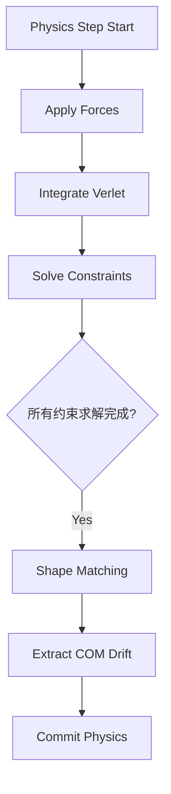

# 物理系统质心分离 (COM Splitting) 设计方案

## 0. 架构定位 (Architecture)

**核心原则**：
> 从此以后，`Object.center`（即 `transform.position`）的唯一职责是：**承载物体整体刚体运动（包括由物理系统提取的平移）**。

*   **约束**：任何 Geometry / Fitting 模块不得复写 `center`，必须通过增量更新维持其“System of Record”地位。

---

## 1. 数学模型 (Mathematical Model)

我们采用 **锚点参考系 (Anchor Reference Frame)** 模型来消除浮点漂移并维持局部坐标稳定性。

*   **定义**：
    *   `currCOM(t)`: 当前帧粒子云的质量加权质心（世界坐标）。
    *   `anchorCOM`: 物理初始化时锁定的参考质心（固定值，不随时间变化）。
    *   `Δdrift(t)`: 当前帧相对于锚点的整体漂移量。

*   **每帧计算逻辑**：
    1.  计算当前质心：`currCOM(t) = Σ(p_i * m_i) / Σm_i`
    2.  计算漂移向量：`Δdrift = currCOM(t) - anchorCOM`
    3.  **归心 (Re-centering)**：将粒子云拉回锚点
        *   `p_i ← p_i - Δdrift`
    4.  **转移 (Transfer)**：将漂移量转移给物体中心
        *   `Object.center ← Object.center + Δdrift`

*   **结果**：
    *   粒子云的质心始终被强制维持在 `anchorCOM` 附近。
    *   物体的整体位移完全由 `Object.center` 承载。

---

## 2. 数据结构 (Data Structures)

在 `obj.representation.physicsState` 下新增以下字段：

| 字段 | 类型 | 说明 | 生命周期 |
|------|------|------|----------|
| `physicsState.anchorCOM` | `{x,y,z}` | **参考锚点**。物理初始化时确定，之后**永不修改**。 | Init 创建，Destroy 销毁 |
| `physicsState.totalMass` | `number` | 粒子总质量。用于快速计算质心。 | Init 创建 |
| `physicsState.initialCOM` | `{x,y,z}` | *[可选]* 仅用于调试/可视化，不参与逻辑。 | Init 创建 |

---

## 3. 实施步骤 (Implementation Steps)

### 步骤 A: 物理初始化 (Initialization)

**位置**：`main.js`，在 `rebuildPhysicsTopology` 之后，`addObject` 之后。

**触发条件** (needReinit)：
*   首次进入物理模式。
*   `physicsState.particles` 被重建。
*   粒子数量或质量 (`totalMass`) 发生变化（如 Edit 态修改了物体结构）。

```javascript
function initPhysicsCOM(obj) {
    const physicsState = obj.representation.physicsState;
    const particles = physicsState.particles;
    
    // 1. 计算初始质量加权质心
    let totalMass = 0;
    let com = { x: 0, y: 0, z: 0 };
    for (const p of particles) {
        // 坐标系说明：p.position 为 World Space
        com.x += p.position.x * p.mass;
        com.y += p.position.y * p.mass;
        com.z += p.position.z * p.mass;
        totalMass += p.mass;
    }
    
    if (totalMass > 0) {
        com.x /= totalMass;
        com.y /= totalMass;
        com.z /= totalMass;
    }
    
    // 2. 初始化状态
    physicsState.totalMass = totalMass;
    physicsState.anchorCOM = { ...com };  // 锁定锚点
    physicsState.initialCOM = { ...com }; // 仅供 Debug
}
```

### 步骤 B: 质心分离 (Extract Drift)

**位置**：`main.js`，在 `_globalPhysicsSystem.step(dt)` 之后，`obj.commitPhysics()` 之前。

```javascript
function extractCOMDrift(obj) {
    const physicsState = obj.representation.physicsState;
    // 安全检查
    if (!physicsState || !physicsState.anchorCOM) return;
    
    const particles = physicsState.particles;
    const anchor = physicsState.anchorCOM;
    const totalMass = physicsState.totalMass;
    
    // 1. 计算当前帧真实质心
    let currCOM = { x: 0, y: 0, z: 0 };
    for (const p of particles) {
        currCOM.x += p.position.x * p.mass;
        currCOM.y += p.position.y * p.mass;
        currCOM.z += p.position.z * p.mass;
    }
    if (totalMass > 0) {
        currCOM.x /= totalMass;
        currCOM.y /= totalMass;
        currCOM.z /= totalMass;
    }
    
    // 2. 计算相对于锚点的绝对漂移
    // 注意：这里的 anchor 是常数
    const drift = {
        x: currCOM.x - anchor.x,
        y: currCOM.y - anchor.y,
        z: currCOM.z - anchor.z
    };
    
    // 3. 归心：将粒子拉回锚点
    for (const p of particles) {
        p.position.x -= drift.x;
        p.position.y -= drift.y;
        p.position.z -= drift.z;
        
        // Verlet 积分历史同步（关键）
        if (p.oldPosition) {
            p.oldPosition.x -= drift.x;
            p.oldPosition.y -= drift.y;
            p.oldPosition.z -= drift.z;
        }
    }
    
    // 4. 转移：将漂移累加到 Object.center
    // center 承载了物体的世界坐标原点变化
    obj.center.x += drift.x;
    obj.center.y += drift.y;
    obj.center.z += drift.z;
}
```

---

## 4. 执行顺序约束 (Execution Order)

这是一个**硬性工程约束**，不可违反：



**关键规则**：
*   **质心分离 (Step G) 必须发生在 Shape Matching (Step F) 之后**。
*   Shape Matching 依赖真实的粒子相对位置，不得插入到约束求解循环内部。

---

## 5. 生命周期与 EDIT 态协同

### 触发重新初始化 (Re-init)
只要满足以下任一条件，必须在进入物理步前调用 `initPhysicsCOM`：
1.  `physicsState` 被销毁或重建。
2.  `physicsState.totalMass` 发生变化（判定条件：`abs(currentTotalMass - savedTotalMass) > epsilon`）。
3.  `restOffset` 被重新计算（Shape Matching 数据更新）。

### EDIT -> FOCUS 过渡
*   如果仅移动了控制点（Control Points）但未改变拓扑/质量：
    *   若 Edit 操作改变了物体的几何中心（Geometry Center），则粒子分布已变，**需要**重新初始化。
    *   **结论**：为安全起见，建议在每次从 EDIT 进入 FOCUS 时都执行一次 `initPhysicsCOM`。

---

## 6. 与 Shape Matching 的关系

*   **设计声明**：
    *   **Shape Matching**：关注粒子相对于质心的**相对形变**（Rotation + Deformation）。
    *   **COM Splitting**：关注粒子云质心的**绝对平移**（Translation）。
    *   两者**职责正交**，不共享状态变量。

*   **执行兼容性**：
    *   Shape Matching 使用当前帧的粒子位置计算临时质心，进行形状恢复。
    *   COM Splitting 随后计算该质心相对于 Anchor 的偏移，进行整体搬移。
    *   两者配合无冲突。

---

## 7. 风险与边界 (Risks & Boundaries)

| 风险点 | 说明 | 应对/验证 |
|--------|------|-----------|
| **角动量 (Angular Momentum)** | 本方案**只分离平移**。物体的旋转仍隐含在粒子位置中，不会转移到 `obj.quaternion`。 | 接受现状。验证物体旋转是否自然。 |
| **Commit Physics 适配** | `commitPhysics` 假设 `particle.position` 为世界坐标。归心后粒子位于 Anchor 附近。若 `center` 远离 Anchor，`lx = p - c` 将包含巨大偏移。 | **风险提示**：需确认 `commitPhysics` 的 `lx` 计算是否符合预期。若出现 Visual Ghosting，需调整 `commitPhysics` 逻辑为 `cp.x = center.x + (p.x - anchor.x)`。 |
| **浮点精度** | 长期运行 `center` 数值可能很大。 | Anchor 机制本身就是为了解决粒子局部坐标精度问题，`center` 使用双精度（JS默认）通常够用。 |

