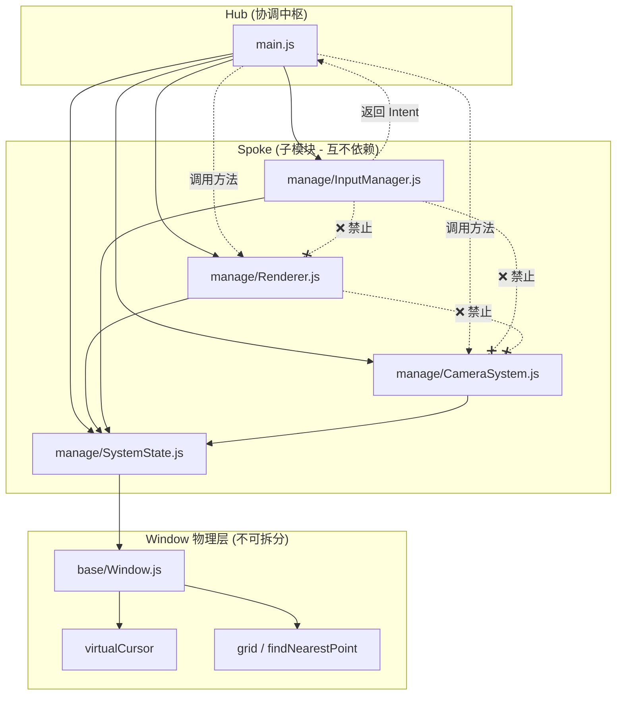

# Main.js Refactoring Plan V3.4 (Detailed Execution Guide)

> **目标**：将 2400+ 行的 main.js 拆分为职责单一的模块，采用 **星型架构**（Hub-and-Spoke），降低耦合。
> **状态**：Phase 1 已完成（代码结构验证），准备进入 Phase 2（物理拆分）。

---

## 1. 核心原则 (Strict Rules)

### 1.1 架构约束

1.  **星型架构 (Hub-and-Spoke)**：
    *   `main.js` 是 **唯一允许协调各模块的中枢（Hub）**。
    *   所有子模块（Renderer / CameraSystem / InputManager / Window 等）之间 **禁止直接依赖或调用**。
    *   若某模块需要另一个模块的结果，**必须通过 `SystemState` 或 `main.js` 转发**。

2.  **Intent 驱动模式**：
    *   `InputManager` **不得调用** `CameraSystem`、`Renderer` 或 `Window`。
    *   `InputManager` **只负责**：将用户输入（键盘/鼠标事件）解析为 **"意图对象（Intent）"** 并返回给 `main.js`。
    *   `main.js` 负责：根据当前 `SystemState` 解释 Intent，调度各子模块。

3.  **纯函数暴露**：
    *   `CameraSystem` / `Renderer` / `Window` 只暴露 **纯函数或无状态方法**。
    *   这些模块 **不感知输入状态、不感知编辑状态**，只接收参数并返回结果。

4.  **禁止过度设计**：
    *   ❌ 不引入 `InteractionConfig`、动态分发系统或字符串 DSL。
    *   ✅ Intent 通过 **普通 JS 对象 + switch** 实现即可。

### 1.2 状态管理约束

5.  **SystemState 权威状态源**：
    *   `SystemState` 是 **跨系统、跨帧** 的权威状态源。
    *   任何模块不得持有自己的 **持久状态副本**，必须引用 `manage/SystemState.js`。
    *   ✅ **允许**：模块内存在 **瞬态 / 局部计算状态**（如鼠标 delta、局部计算 cache、函数级中间值）。

6.  **Window.js 不可拆分**：
    *   `base/Window.js` 被视为 **"视窗 + 投影 + 虚拟鼠标的物理层"**，不是 UI 或交互层。
    *   本 Phase 2 **不允许**对 Window.js 内部职责进行再抽象或再拆分。
    *   Window.js 已完整承担虚拟鼠标的物理实现（`grid`、`findNearestPoint`、`virtualCursor`）。

---

## 2. Intent 对象规范

### 2.1 Intent 类型示例

```javascript
// Intent 是普通 JS 对象，无需复杂类型系统
const intent = {
  type: 'ROTATE_CAMERA',      // 意图类型
  payload: { deltaX: 5, deltaY: 0 }  // 意图参数
};

const intent2 = {
  type: 'ENTER_FOCUS',
  payload: { targetObject: obj }
};

const intent3 = {
  type: 'MOVE_OBJECT',
  payload: { x: 10, y: 20, z: 0 }
};
```

### 2.2 main.js 中的 Intent 处理

```javascript
// main.js 中的 Intent 处理示例（伪代码）
function processIntent(intent) {
  if (!intent) return;
  
  switch (intent.type) {
    case 'ROTATE_CAMERA':
      userRotate(intent.payload.deltaX * CONFIG.rotationSpeed);
      break;
    case 'ENTER_FOCUS':
      enterFocusState(intent.payload.targetObject);
      break;
    case 'MOVE_OBJECT':
      moveObjectTo(SystemState.draggingObject, 
                   intent.payload.x, intent.payload.y, intent.payload.z);
      break;
    // ... 其他 Intent 类型
    default:
      console.warn('Unknown intent:', intent.type);
  }
}
```

---

## 3. 详细执行步骤 (Execution Steps)

### Phase 1: 解耦根依赖 (Foundation)

#### [STEP 1.1] 提取 SystemState.js
*   **类型**：代码迁移 (Migration)
*   **源文件**：`main.js` (L10-125 左右)
*   **目标文件**：`manage/SystemState.js`
*   **操作细节**：
    1.  创建 `manage/SystemState.js`。
    2.  将 `CONFIG` 常量对象和 `SystemState` 对象定义完全剪切过去。
    3.  **处理 ObjectFactoryImpl**：`SystemState.objects` 的初始化调用了 `ObjectFactoryImpl.createTestScene()`。
        *   `SystemState.js` 必须 `import { ObjectFactoryImpl } from './ObjectFactoryImpl.js'`。
    4.  在 `main.js` 中 `import { SystemState, CONFIG } from './manage/SystemState.js'`。
*   **禁止事项**：
    *   🔴 禁止修改 `CONFIG` 或 `SystemState` 的属性名。
    *   🔴 禁止将 `init()` 函数移入此处。

### Phase 2: 核心系统独立 (Core Subsystems)

#### [STEP 2.1] 提取 Renderer.js
*   **类型**：封装迁移 (Encapsulation)
*   **源文件**：`main.js` (L724-878 左右, Renderer 对象)
*   **目标文件**：`manage/Renderer.js`
*   **职责**：**纯渲染，不感知任何交互状态**
*   **操作细节**：
    1.  创建 `manage/Renderer.js`。
    2.  移动 `Renderer` 对象（包含 `forEachNeighbor`, `drawColoredPointImpl`, `render`, `renderPointSimple`, `renderScreenPointsHelper`）。
    3.  **依赖**：只依赖 `SystemState`（读取 ctx, width, height, objects）和 `StyleImpl`（LUT）。
    4.  **导出**：`export const Renderer = { ... }`。
*   **禁止事项**：
    *   🔴 禁止依赖 `InputManager` 或 `CameraSystem`。
    *   🔴 禁止读取 `interactionState`、`isDragging` 等输入相关状态。

#### [STEP 2.2] 提取 CameraSystem.js
*   **类型**：代码迁移 (Migration)
*   **源文件**：`main.js` (L127-246 左右, `initCamera`, `processCamera`, `drawCameraFeedOnMainCanvas` 等)
*   **目标文件**：`manage/CameraSystem.js`
*   **职责**：**纯摄像头处理，不感知任何交互状态**
*   **操作细节**：
    1.  创建 `manage/CameraSystem.js`。
    2.  移动摄像头相关的初始化和处理函数。
    3.  只暴露纯函数，如 `initCamera()`, `processCamera()`, `drawCameraFeed(ctx, x, y, w, h)`。
*   **禁止事项**：
    *   🔴 禁止依赖 `InputManager` 或 `Renderer`。
    *   🔴 禁止读取 `interactionState`、`keys` 等输入相关状态。

### Phase 3: 交互逻辑拆分 (Interaction Logic)

#### ~~[STEP 3.0] 提取 CursorSystem.js~~ ❌ 已取消

> **取消原因**：`base/Window.js` 已完整承担虚拟鼠标的物理实现。
> **虚拟鼠标的唯一访问入口为**：`SystemState.mainWindow.virtualCursor`

#### [STEP 3.1] 提取 InputManager.js
*   **类型**：**Intent 生成器（不是控制器）**
*   **源文件**：`main.js` (InputMaps, handleView..., handleFocus..., handleEdit...)
*   **目标文件**：`manage/InputManager.js`

> ⚠️ **关键约束 (硬性规定)**：
> 
> `InputManager` **不允许**：
> *   ❌ 调用 `CameraSystem` / `Renderer` / `Window` 的任何方法
> *   ❌ 直接修改 `SystemState` 中的物体位置、相机位置等
> *   ❌ 直接访问 `grid`、`findNearestPoint` 等底层结构
> *   ❌ 持有任何 **长期状态**（跨帧存储）
> 
> `InputManager` **只允许**：
> *   ✅ 读取 `SystemState.interactionState` 选择当前状态的处理逻辑
> *   ✅ 读取 `SystemState.keys`、`SystemState.lastMouseX` 等原始输入
> *   ✅ 读取 `SystemState.mainWindow.virtualCursor.activePoint` 获取吸附点坐标
> *   ✅ **返回 Intent 对象** 给 `main.js`

*   **改造要点**：
    1.  将原 `handle*` 函数改造为 **返回 Intent**，而非直接执行操作。
    2.  例如：原 `handleViewWheel(e)` 直接调用相机移动 → 改为返回 `{ type: 'CAMERA_ZOOM', payload: { delta: e.deltaY } }`。
    3.  `main.js` 中 `gameLoop` 调用 `InputManager.getIntent()` 获取 Intent，然后在 `main.js` 中执行实际操作。

*   **操作细节**：
    1.  创建 `manage/InputManager.js`。
    2.  移动 `InputMaps` 对象定义。
    3.  将所有 `handle[State][Action]` 函数改造为返回 Intent 对象。
    4.  导出 `getIntent(event, eventType)` 主入口函数。
*   **禁止事项**：
    *   🔴 禁止 `import` 任何其他子模块（CameraSystem / Renderer / Window）。
    *   🔴 禁止直接调用 `userRotate`、`moveObjectTo`、`enterFocusState` 等函数。

### Phase 4: main.js 中枢职责 (Hub)

#### [STEP 4.1] main.js 作为协调中枢
*   **main.js 应保留的职责**：
    *   `init()`：初始化所有子系统
    *   `gameLoop()`：主循环
    *   `setupEventListeners()`：绑定事件 → 调用 `InputManager.getIntent()`
    *   `processIntent(intent)`：根据 Intent 类型调度各子模块
    *   所有实际的状态修改操作（`userRotate`、`moveObjectTo`、`enterFocusState` 等）
*   **main.js 的中枢模式**：
    ```
    事件 → InputManager.getIntent() → Intent → main.js.processIntent() → 调用子模块
    ```
*   **验证**：
    *   代码行数应大幅减少 (< 800 行)。
    *   运行测试场景，确保所有交互功能正常。

---

## 4. 依赖关系图 (Target Architecture)



---

## 5. 风险控制备忘

| 风险点 | 控制措施 |
|--------|----------|
| 子模块之间产生直接依赖 | 严格星型架构，子模块只能依赖 SystemState |
| InputManager 成为新的 main.js | 改为 Intent 生成器，只返回对象不执行操作 |
| Intent 设计过度复杂 | 普通 JS 对象 + switch，禁止 DSL 和动态分发 |
| SystemState 规则过严 | 区分跨帧持久状态 vs 瞬态计算状态 |
| Window.js 被过度拆分 | Phase 2 禁止对 Window.js 内部职责再抽象 |
| Renderer/Camera 感知交互状态 | 只暴露纯函数，不读取 interactionState |


